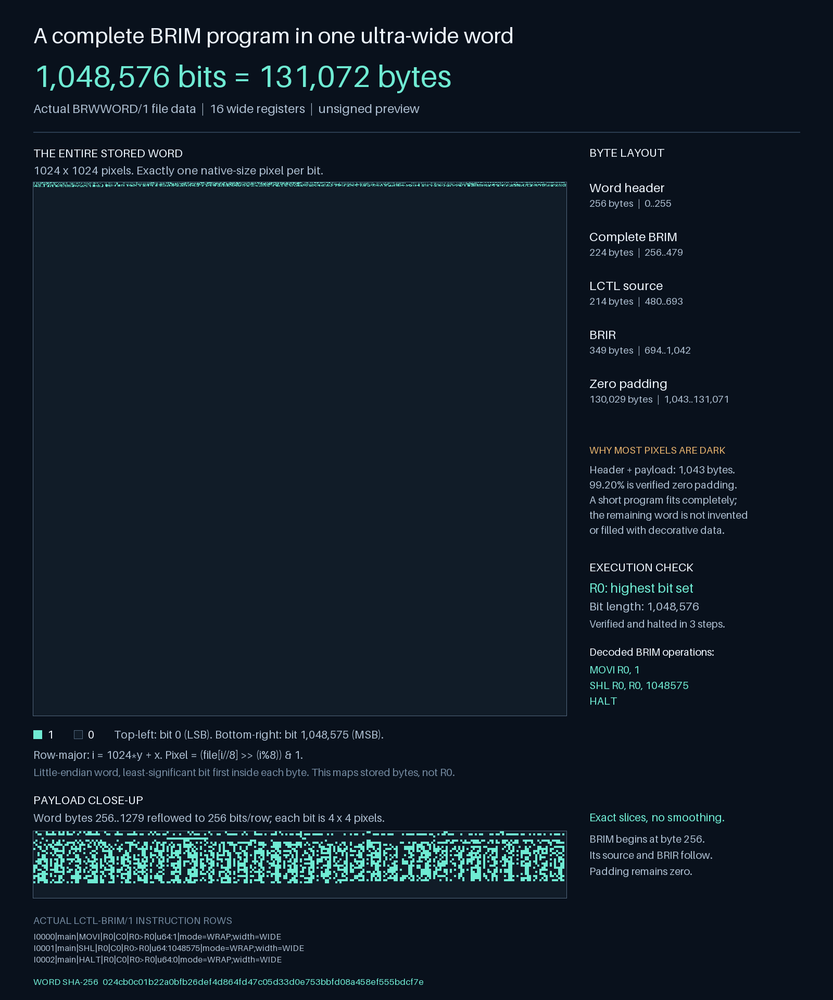

# UltraWide Appliance

**0.2.0 Product Preview · 1,048,576-bit software words · LCTL and BRIM image tools**

UltraWide Appliance is an independently bootable Linux preview for an
ultra-wide virtual machine. This revision restores the complete delivered
BASIC-1048576 instruction set and adds real BRIM images compiled from a
documented LCTL extension. It also implements **one complete small BRIM
program image inside each 128 KiB ultra-wide word**, with verified links
between the words and full-width register handoff between their programs.

The earlier eight-operation UWA demo remains available, but it is no longer
the main virtual-machine implementation. The [source audit](docs/SHS-AUDIT.md)
compares that first preview with the supplied BASIC 1048576 Universe JA-20
installer, identifies missing behavior and original defects, and records
the provenance of the recovered core.

## What runs

| Profile | Implemented behavior | Format |
| --- | --- | --- |
| BASIC-compatible SHS | 16 registers, 24 instructions, 18 widths, four modes, flags, branches, capability-backed memory, full-word stack, five services | Original `B1048576E` images and reversible `LCTLC-WIDE/0.1` source |
| BRIM execution | Actual BR-480 ISA 4.1 images; 19 pure control/arithmetic operations on full 1,048,576-bit registers | `.brimg` with BRPV provenance and matching BRIR |
| BRIM compiler | Strict eight-column, full-width control/arithmetic dialect | Explicit `LCTL-BRIM/1`, stored as `.lctlb` |
| Program-word chain | Complete BRIM image + source + BRIR in every 131,072-byte word; exact source recompilation, hash links and register handoff | New `BRWWORD/1`, stored as `.brw` |
| Object repository | Bounded immutable SHA-256 objects with verified reads and exclusive publication | Independent HERMIT-inspired preview API |
| Boot appliance | Diskless Alpine x86-64, offline signed packages, unprivileged console, no NIC or host disks in the default launcher | BIOS/UEFI optical ISO build kit |

These are software words on ordinary x86-64 hardware. Linux supplies boot and
drivers; Python hosts the virtual machines. The supplied Windows installer,
Linux kernel, Python interpreter, and full language suite have not been
translated wholesale into LCTL. This is an independently bootable hosted
virtual system, not a compiler compiling itself.

## Try the virtual system

Use Python 3.12 or newer. The runtime has no third-party Python dependencies.

```sh
git clone https://github.com/LKVexa/UltraWide-Appliance.git
cd UltraWide-Appliance
export PYTHONPATH=src
python3 -m ultrawide self-test
python3 -m ultrawide shs run examples/shs-control-memory-stack.lctlw
python3 -m ultrawide chain verify examples/brim-word-chain.brw
python3 -m ultrawide chain run examples/brim-word-chain.brw
python3 -m unittest discover -s tests -v
```

In PowerShell set `$env:PYTHONPATH = (Resolve-Path .\src).Path`, then use
`py -3 -m ultrawide ...` with the same arguments. Optional installation in a
virtual environment is `python -m pip install -e .`; it adds the `ultrawide`
command. Run commands emit compact JSON evidence, including full-width word
hashes instead of enormous decimal numbers. Outputs are never overwritten.

The SHS control example exercises a backward branch, memory, stack and
services and outputs `5` followed by a newline. The chain example executes
two complete programs: the first creates the highest bit in R0; the second
receives it and produces the full-width wrapping sum in R1.

## Translate BASIC programs into LCTL and back

```sh
python -m ultrawide shs translate examples/shs-control-memory-stack.b1048576asm program.lctlw
python -m ultrawide shs compile program.lctlw program.b1048576
python -m ultrawide shs inspect program.b1048576
python -m ultrawide shs run program.b1048576 --max-steps 4096 --memory-bytes 1048576
```

`translate` also accepts original BASIC executable images. The LCTL transport
preserves every instruction field and the original JSON header bytes, so
compiling the translation reproduces the accepted executable exactly.
It rejects the Windows `.exe` installer as a machine image. See
[SHS-FORMAT.md](docs/SHS-FORMAT.md) for the dialect, original semantics,
intentional hardening differences and supported limits.

## Compile BRIM images and string them along ultra-wide words

The [one-word binary example](examples/brim-one-word.brw) is exactly
131,072 bytes / 1,048,576 bits. The raw BRIM payload inside it is 224 bytes;
the rest holds source, metadata, IR and checked zero padding. The image below
is rendered from the actual file bytes, with a 1024 by 1024 bit matrix.



```sh
python -m ultrawide brim compile examples/brim-top-bit.lctlb top-bit.brimg
python -m ultrawide brim verify top-bit.brimg --source examples/brim-top-bit.lctlb --brir top-bit.brir
python -m ultrawide chain pack programs.brw examples/brim-top-bit.lctlb examples/brim-wrap-next.lctlb
python -m ultrawide chain run programs.brw
python -m ultrawide chain unpack programs.brw unpacked-programs
```

Reproduce the example binaries and this data image with
`python scripts/render_word_image.py` in a development environment containing
Pillow. Pillow is optional and is not required to run the virtual system.

Every program word contains a 256-byte header, the complete BRIM image,
its readable LCTL source, its BRIR and zero padding. The chain checks source
compilation and all word links before executing anything. Oversized programs
are rejected; images are not fragmented. `HALT` finishes the current image,
then all sixteen registers pass to the next word with fresh PC/flags.

The Python APIs `brim_wide.as_operands(chain_bytes)` and
`brim_wide.from_operands(operands)` convert complete program words to exact
unsigned 1,048,576-bit operands and back, preserving every byte. The chain
runner can also receive full-width initial data operands through its
`registers` argument. See [WORD-CHAIN.md](docs/WORD-CHAIN.md) for the complete
byte layout, execution convention and limits, and [BRIM.md](docs/BRIM.md)
for actual BRIM capabilities and the separately named full-SHS binding bundle.

`LCTL-BRIM/1` and `LCTLC-WIDE/0.1` are explicit extensions. They do not claim
compatibility with the supplied quantum `LCTLC/1.0` compiler or the candidate's
separate native `LCTLC/1.1` authority. BASIC and BRIM have different flags,
shift operands and overflow modes; this implementation never silently
reinterprets one dialect as the other.

## Build and boot independently of Windows

Follow [BUILD.md](docs/BUILD.md) to obtain hash-pinned public Alpine inputs,
build an ISO offline, and run it with separately installed QEMU. The default
image starts its checks as the unprivileged `ultrawide` account; root password
login is locked. The launcher attaches no network interface, host filesystem,
or disk. Guest state is held in RAM and disappears when the VM stops.

The source repository includes the runtime, build kit and small example
images. It does not include the original installer, application candidate,
large corpora, models, QEMU, Alpine package archives or a Linux ISO. Adding an
application is a separate, explicit build-hook integration; the optional hook
does not grant it additional host access or qualify its behavior.

## Verification and remaining scope

The validation suite compares original and translated BASIC execution across
all 24 operations, 18 widths and four modes, plus independent arithmetic
expectations, malformed input, capability/memory bounds, cancellation,
deadlines, BRIM interoperability, source/image binding, word-chain handoff,
and repository/build boundaries. [VERIFICATION.md](docs/VERIFICATION.md)
records actual results and links the receipts for this revision.

Execution is bounded, but the Python interpreter is not a hardened process
sandbox. Hashes detect corruption and bind artifacts; they do not authenticate
an author. Signed BRIM/BRTM images are rejected by this unsigned preview.
Physical hardware, Secure Boot, a native full BR-480 service host, the complete
JA compiler suite, Windows application compatibility, persistent appliance
state and VIVIAN application/model integration are not qualified here.
The [audit](docs/SHS-AUDIT.md) keeps these gaps visible.

## License and contributions

[Product Preview Tester License 1.1](LICENSE) permits evaluation, testing,
internal experiments and preview forks under its stated terms. Production
deployment, customer-facing services and commercial distribution require
separate written permission. This is a source-available preview with a custom
license, not an OSI-approved open-source release. The license now names the
expanded runtime, LCTL/BRIM tools and program-word chain; third-party licenses
remain intact. See [THIRD-PARTY-NOTICES.md](THIRD-PARTY-NOTICES.md) and the
[contribution guide](CONTRIBUTING.md). Report reproducible failures through
[GitHub Issues](https://github.com/LKVexa/UltraWide-Appliance/issues).
